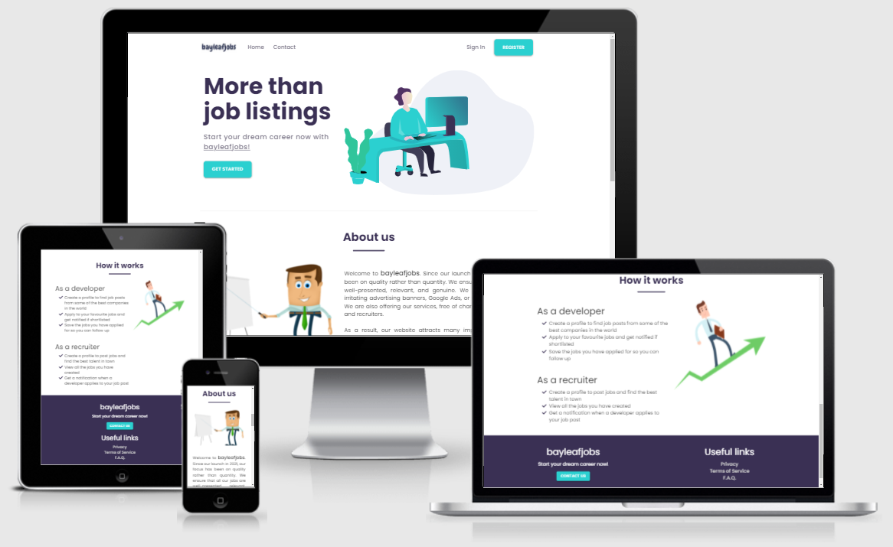

# bayleafjobs
bayleafjobs is a a job listing site, where users can either register as developers who are looking for work or as recruiters who are looking to hire developers for their clients. I created this site for Milestone Project 3 as part of the Code Institute's Full Stack Software Development course. I developed this project using HTML, CSS, JavaScript, Python, Flask and MongoDB as the core technologies as well as concepts and techniques learnt in the Backend module of the course. 

You can view the live site [here](https://bayleafjobs.herokuapp.com/).

# Project Requirements

Build a full-stack site that allows your users to store and manipulate data records about a particular domain. The website will respond to user actions and alters the way the site displays data/information.

Required Technologies : HTML, CSS, JavaScript, Python, Flask, MongoDB. 

## Table Of Contents

- [User Experience Design - UX](#user-experience-design---ux)
  - [Strategy](#strategy)
  - [Scope](#scope)
  - [Structure & Skeleton](#structure--skeleton)
  - [Surface](#surface)
- [Database Design](#database-design)
- [Technologies Used](#technologies-used)
  - [Languages](#languages)
  - [Tools & Resources](#tools--resources)   
- [Testing](#testing)
  - [User Stories Implementation](#user-stories-implementation)
  - [Browser Compatibility](#browser-compatibility)
  - [Responsiveness](#responsiveness)
  - [HTML Validation](#html-validation)
  - [CSS Validation](#css-validation)
  - [Javascript Validation](#javascript-validation)
  - [Form Validation](#form-validation)
  - [Further Testing](#further-testing)
- [Deployment](#deployment)
- [Credits](#credits)
- [Acknowledgements](#acknowledgements)

# User Experience Design - UX

## Strategy

My Milestone Project 3 from the Code Institute is a website will help users find a suitable job and start their dream career or help their clients find top developers to help their company grow.

The purpose of this project is to create a website that allows users to create, use, read, edit and delete data. In particular, recruiters can create, edit and delete jobs as well as view who applied to their jobs. The users can also update or delete their profile. Developers can apply to jobs, contact recruiters as well as update or delete their profile.

- ### User Stories

    - As a User, I want to be presented with a well-structured website, where I can easily navigate and find all the information that I need.

    - As a User, I want to be able to easily view information on how to use the website as well as the website's terms of service.

    - As a User, I want to be able to contact the website owner in order to ask questions or send feedback.

    - As a User, I want the UI and design to be consistent throughout the website, so it will be visually appealing and easy to navigate.

    - As a User, I want to be able to update or delete my profile as well as add a profile picture.

    - As a User (Developer), I want to easily view all the available jobs, see the description and quickly apply.

    - As a User (Developer), I want to be able to filter the jobs in order to find the ones that are more suitable for me.

    - As a User (Developer), I want to be able to view when a job was posted and other info so I can decide if I should apply.

    - As a User (Developer), I want to be notified that my application was sent successfully and view all the jobs I applied to on my profile.

    - As a User (Developer), I want to be able to contact the recruiter in case I have questions about a job or simply want to follow up on my progress.

    - As a User (Recruiter), I want to easily create jobs and add role and company information that can help me find the best talent. 

    - As a User (Recruiter), I want to be able to see who has applied to my job posts as well as if the applicants meet my client's criteria.

    - As a User (Recruiter), I want to be able to update the job description as per my client's request or delete them if the position is no longer open.

    - As a User (Recruiter), I want to be notified when a developer has applied to my job post and view all applicants quickly on my profile.

## Scope

This project is developed as a Minimal Viable Product. There will be room for future improvements and releases incorporating additional pages and features as well as improved design.

- ### Current Features

	- Users can create and sign in to their account and get a welcoming email from the website.

    - Users can customize their profile, add a picture as well as delete it if they wish.

    - Users can contact the website owner.

    - Users can find information on how to use the website.

    - Users (Developer) can view and filter jobs based on keywords to find the ones they like.

    - Users (Developer) can apply to their dream jobs and get notifications that their application was received.

    - Users (Developer) can email the recruiter directly to ask questions or check their application progress.

    - Users (Recruiter) can create a job, add a detailed description and company info.

    - Users (Recruiter) can edit the job description if necessary without having to re-create the post.

    - Users (Recruiter) can view everyone who applied to their job posts and find the most suitable candidate.

    - Users (Recruiter) get emails once a developer has applied to their job posts.

- ### Future Features

    - I would like to allow users to update their password in case they forget it.

    - I would like to offer the option to 'Remember Password' so that Users don't have to type their password every time they log in.

    - I would like to add a recaptcha when registering, contacting website owner and applying to jobs to avoid bots and spam.

## Structure & Skeleton

I have designed the structure and layout of the website using Materialize and CSS Grid. I have created low fidelity wireframes for desktop and mobile using Balsamiq in order to guide me in designing the pages. The design and layout of the website has evolved from the original Balsamiq wireframes. You can view the original low fidelity wireframes below.

-  ### Wireframes
 
	**Home Page**
    
    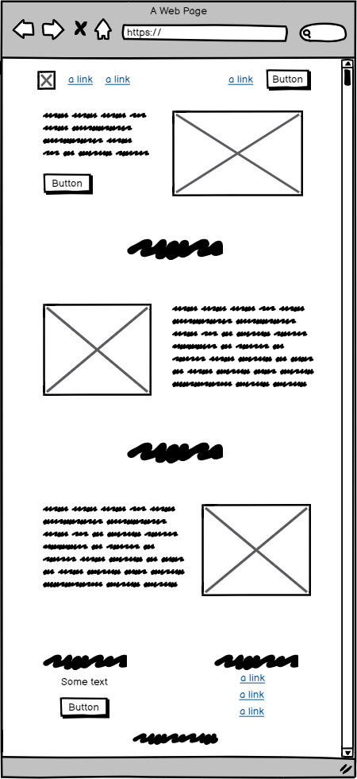

    **Contact Page**
    
    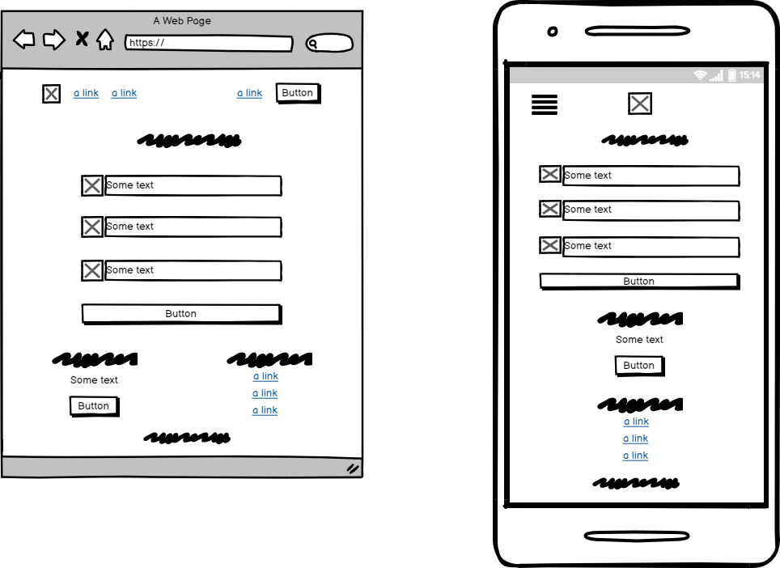

    **Sign In Page**
    
    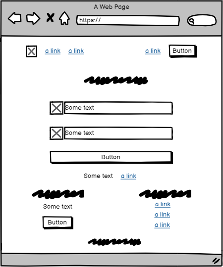

    **Register Page**
    
    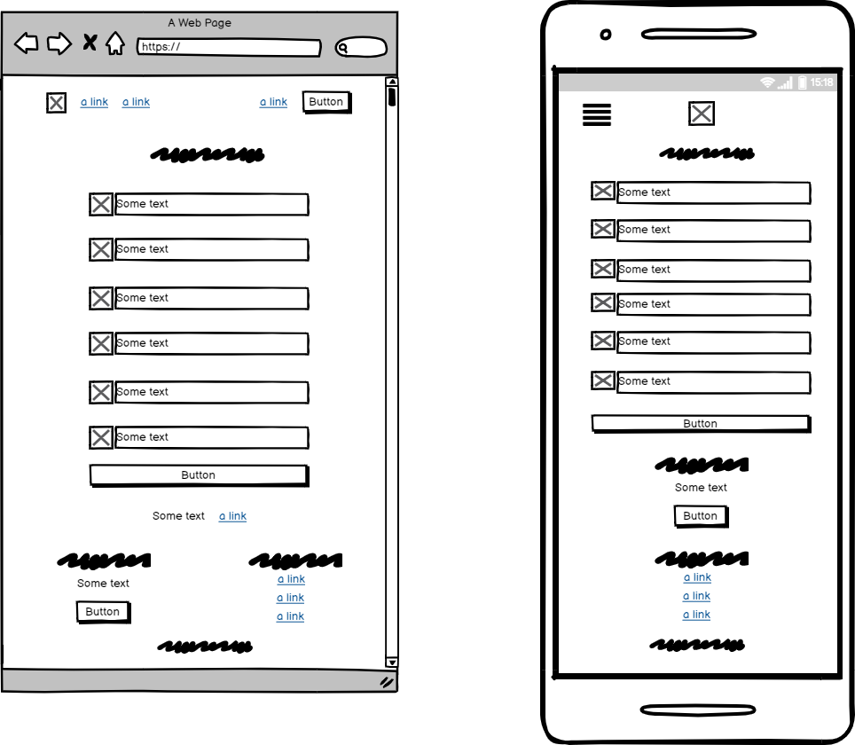

    **Profile Page**
    
    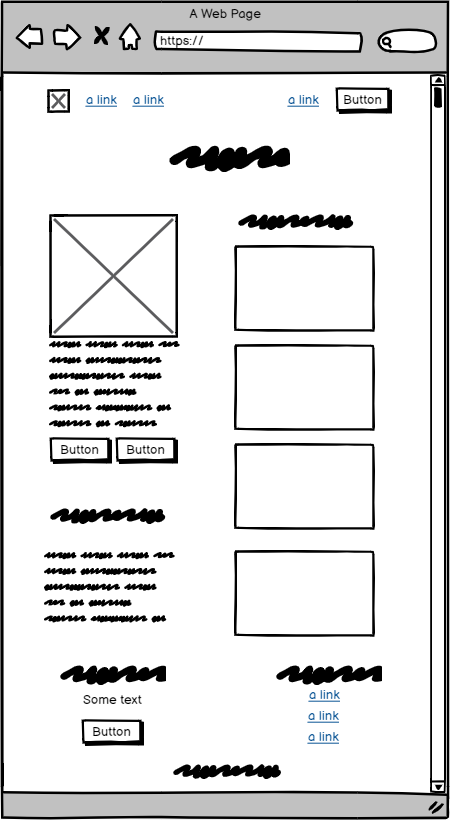

    **Update Profile Page**
    
    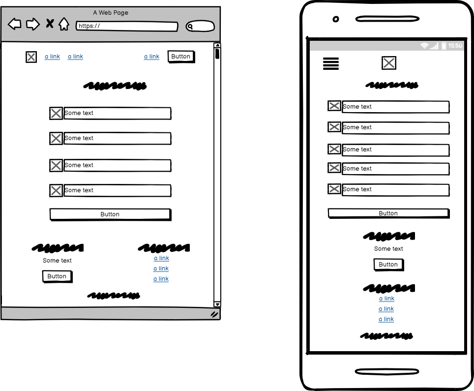

    **View Jobs Page**
    
    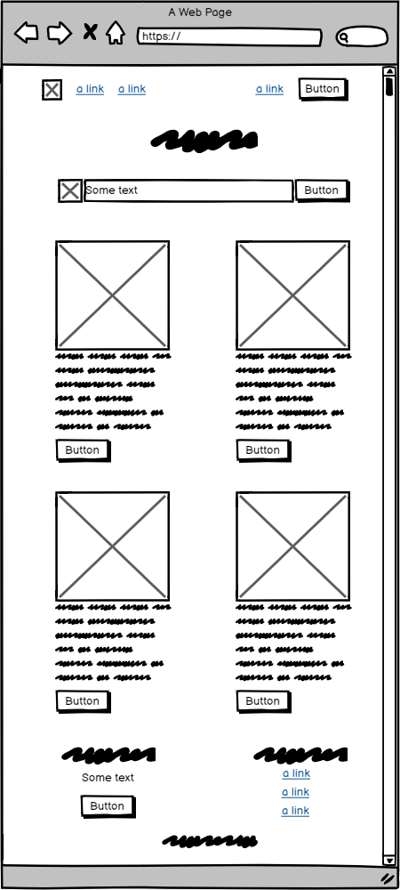

    **Single Job Page**
    
    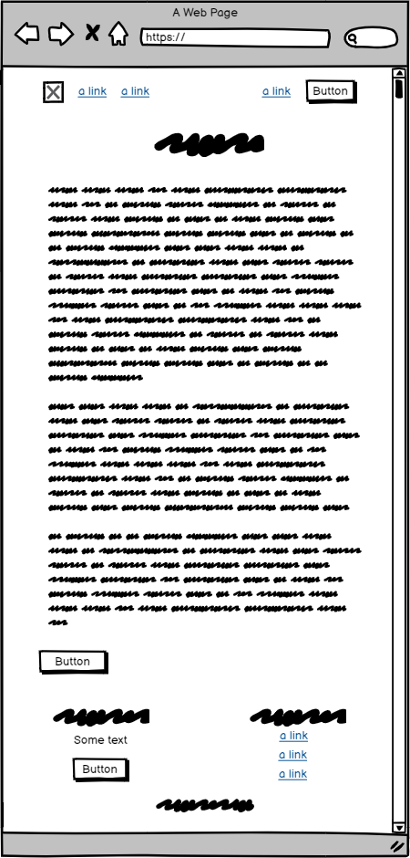

    **Create Job Page**
    
    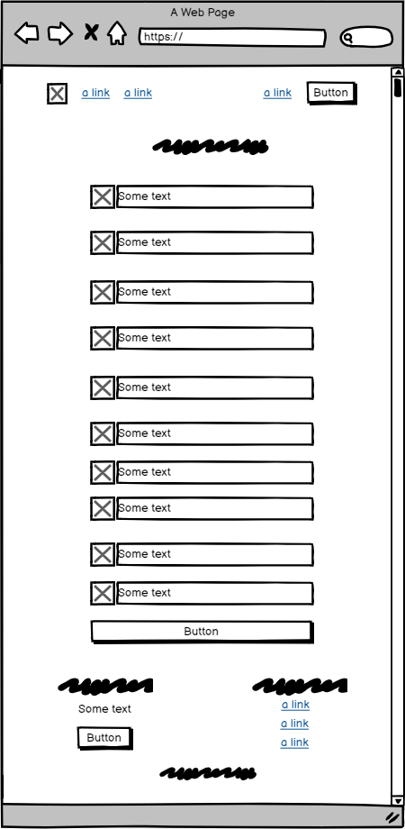

    **Update Job Page**
    
    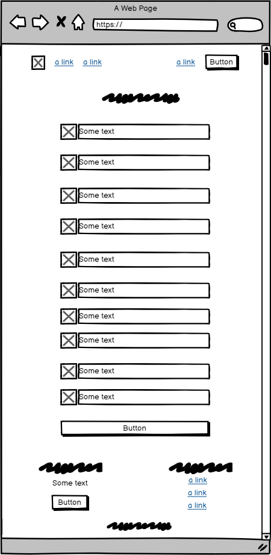

    **Privacy Page**
    
    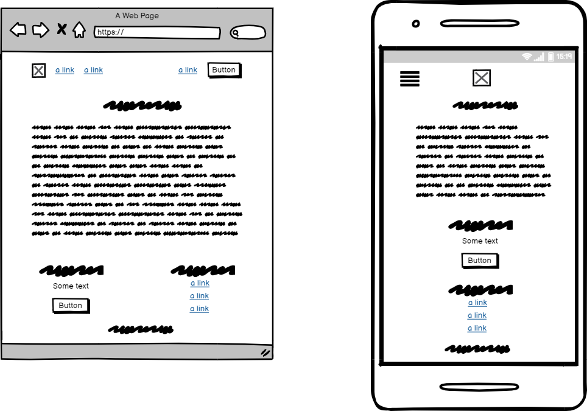

    **F.A.Q. Page**
    
    

    **Terms & Conditions Page**
    
    

## Surface

-   ### Colour Scheme

    -   The main colours used are cyan, gray, dark violet and dark blue. 

    -   Dark Blue is used for the headings, icons and when hovering the job cards.

    -   Dark violet is used for the job cards and the footer.

    -   Cyan is used on the background of all the buttons.

    -   Gray is used for secondary text and navigation.

    -   Black is used for normal paragraphs.

-   ### Typography

    -   I have used [Google Fonts](https://fonts.google.com/) to import the fonts for the website.

    -   The font that I imported is Poppins and the weights are 500, 700, 900. I have used this font as it makes the design look fun and relaxed, which works well with the landing page images.

    -   Sans Serif is used as the fallback font in case Poppins is not being imported into the site correctly.

    -   The default font size was increased to 18px to add to the fun and relaxed design of the website.

-   ### Images

    -   I have used [Pixabay](https://pixabay.com/) to source all the images of the website. You can find more information on the Credit section.
    
-   ### Icons

    -   I have used [fontawesome](https://fontawesome.com/) to source all the icons used in the website.

-   ### Structure & Layout

    -   Materialize was used to structure the navbar, profile, forms and landing page.

    -   CSS grid was also used to help position elements on the page including sticking the footer to the bottom and position the list elements of the navbar.

# Database Design

The database consist of three collections. Created and hosted using [MongoDb](https://en.wikipedia.org/wiki/MongoDB)

-   ### users

    -   _id
    -   username
    -   email
    -   password
    -   location
    -   role
    -   picture

-   ### jobs

    -   _id
    -   company
    -   company_logo
    -   position
    -   location
    -   salary
    -   level
    -   stack
    -   contract
    -   description
    -   posted_by
    -   date_posted
    -   contact_email

-   ### applications

    -   _id
    -   notice_period
    -   current_salary
    -   desired_salary
    -   resume
    -   cover_letter
    -   applicant_username

#### I created an index on the jobs collection so that users can filter jobs using the following parameters.

   -    company
   -    position
   -    location
   -    level
   -    stack
   -    contract

# Technologies Used

## Main

-   [HTML5](https://en.wikipedia.org/wiki/HTML5)

-   [CSS3](https://en.wikipedia.org/wiki/Cascading_Style_Sheets)

-   [JavaScript](https://en.wikipedia.org/wiki/JavaScript)

-   [Python](https://en.wikipedia.org/wiki/Python_(programming_language))

-   [Flask](https://en.wikipedia.org/wiki/Flask_(web_framework))

-   [MongoDb](https://en.wikipedia.org/wiki/MongoDB)

## Secondary

1. [VS Code](https://code.visualstudio.com/)
    -   VS Code was my IDE of choice for writing the HTML, CSS and JavaScript code.

2. [Google Fonts](https://fonts.google.com/)
    -   Google Fonts was used to import my fonts of choice into CSS for use throughout the game.

3. [Font Awesome](https://fontawesome.com/)
    -   Font Awesome was used to add icons to the game for aesthetic and UX purposes.
    
4. [Git](https://git-scm.com/)
    -   Git was used to help me manage and keep track of my source code history.

5. [Sourcetree](https://www.sourcetreeapp.com/)
    -   Sourcetree simplified and visualized my interaction with the Git repository.

6. [GitHub](https://github.com/)
    -   GitHub was used to store and manage the Git repository.

7. [Balsamiq](https://balsamiq.com/)
    -   Balsamiq was used to create the wireframes during the design and prototyping process.

8. [Chrome DevTools](https://developers.google.com/web/tools/chrome-devtools)
    -   Chrome DevTools helped me debug issues that I've had during development. In addition to that, by using the inspection mode, I could see how responsive all the pages are.

9. [W3C Validation Services](https://validator.w3.org/)
    -   W3C Validation Services were used to help me check if my HTML and CSS code has any errors and that it adheres to the web standards. More details in the Testing section.

10. [JS Hint](https://jshint.com/)
    -   JS Hint used to help me check if my Javascript code has any errors and that it adheres to the web standards. More details in the Testing section.

11. [Am I Responsive](http://ami.responsivedesign.is/)
    -   Am I Responsive was used during my testing phase to check the responsiveness and look of all the pages.

12. [Techsini Multi Device Mockup Generator](https://techsini.com/multi-mockup/index.php)
    -   Techsini Multi Device Mockup Generator was used during my testing phase to check the responsiveness and look of all the pages.

13. [CSS Minifier](https://cssminifier.com/)
    -   CSS Minifier was used to minify the CSS file in order to improve loading speed and performance.

14. [WAVE Web Accessibility Evaluation Tool](https://wave.webaim.org/)
    -   WAVE Accessibility Evaluation Tool was used to help me make my content more accessible to users with disabilities.

15. [Flask Mail](https://pythonhosted.org/Flask-Mail/)
    -   Flask Mail was used to enable users to send emails to the website owner as well as receive notifications from the website.

16. [WTForms](https://wtforms.readthedocs.io/en/2.3.x/)
    -   WTForms was used to help me create and validate all the forms on the website.

17. [Autoprefixer CSS](https://autoprefixer.github.io/)
    -   Autoprefixer CSS was used to help me add suitable vendor prefixes for better cross-browser compatibility.

18. [Canva](https://www.canva.com/)
    -   Canva was used to design the favicon of the page.

# Testing

## Manual Testing

-   **Register**   

    I checked that the register button directs User to the register page. I checked that an account is created with the correct infomation from the form. I checked that all inputs on the form are validated successfully. I checked that a welcome email is sent to the email address I used and a flash message appears on screen. I checked that after registration, User is redirected to the sign in page.

-   **Sign In**   

    I checked that the sign in button directs User to the signin page. I checked that the sign in validation works if User add wrong information. I checked that after signing in, User is redirected to the profile page.

-   **Sign Out**   

    I checked that the sign our button removes the session variables, signs out the User and redirects to the home page. A flash message appears on screen to inform the User they have signed out.

-   **Contact**   

    I checked that the contact button directs User to the contact page. I checked that an email is successfully sent when submitting the form and a flash message appears on screen.

-   **New Job**   

    I tested that all inputs on the job form are correctly validated and a new job is added to the database with the correct info. I checked that after the job is created the User is redirected to their profile and a flash message appears on screen. An email notification is sent to the User to infom them the job has successfully been created.

-   **Update Job**   

    I tested that the job successfully updates all the info on the database and a flash message appears on screen. All inputs are successfully tested for errors.

-   **Delete Job**   

    I tested that the job is successfully removed from the database once deleted and a flash message appears on screen.

-   **Application**   

    I tested that all inputs on the application form are correctly validated and an application is added to the database with the correct info. I checked that after the application is sent, the User is redirected to their profile and a flash message appears on screen. An email notification is sent to the User to infom them the application was sent successfully.

-   **Update Profile**   

    I tested that the profile successfully updates all the info on the database and a flash message appears on screen. All inputs are successfully tested for errors.

-   **Delete Profile**   

    I tested that the profile is successfully removed from the database once deleted and a flash message appears on screen.

## User Stories Implementation

-   **Requirement**

    As a User, I want to be presented with a well-structured website, where I can easily navigate and find all the information that I need. 

-   **Implementation**

    This was achieved by making a consistent design on all the pages, allow enough white space to better digest the information on each page. Text has large enough font size and colour contrast to be easily read. Relevant icons were used to signify what each button and action is meant to do.

-   **Requirement**

    As a User, I want to be able to easily view information on how to use the website as well as the website's terms of service.

-   **Implementation**

    This was achieved by adding an About Us and How It Works section on the landing page as well as a F.A.Q. and Terms & Conditions page that are always accessible from the footer.

-   **Requirement**

    As a User, I want to be able to contact the website owner in order to ask questions or send feedback.

-   **Implementation**

    This was achieved by adding a contact form which is accessible from the navigation bar at the top of the page.

-   **Requirement**

    As a User, I want the UI and design to be consistent throughout the website, so it will be visually appealing and easy to navigate.

-   **Implementation**

    This was achieved by using the same typography, colors and layout on all pages. The website also includes an easy to use nav bar which makes navigation easy and quick.

-   **Requirement**

    As a User, I want to be able to update or delete my profile as well as add a profile picture.

-   **Implementation**

    This was achieved by showing Update and Delete buttons on the profile card below the users information. A defense mechanism was added to the Delete button to prevent Users from accidentally deleting their profile.

-   **Requirement**

    As a User (Developer), I want to easily view all the available jobs, see the description and quickly apply.

-   **Implementation**

    This was achieved by creating a page that displays all the available jobs, with a More Info button which displays the full description of each job as well as an Apply button.  

-   **Requirement**

    As a User (Developer), I want to be able to filter the jobs in order to find the ones that are more suitable for me.

-   **Implementation**

    This was achieved by adding a search bar on the top of the View Jobs page that filters the jobs based on keywords.
    
-   **Requirement**

    As a User (Developer), I want to be able to view when a job was posted and other info so I can decide if I should apply.

-   **Implementation**

    This was achieved by showing a lot of information when Users click More Info on the job they desire as well as the date it was posted by the recruiter.
    
-   **Requirement**

    As a User (Developer), I want to be notified that my application was sent successfully and view all the jobs I applied to on my profile.

-   **Implementation**

    This was achieved by sending the User an automated email once the application has been successfully sent to the database, which can then be viewed by the relevant recruiter.
  
-   **Requirement**

    As a User (Developer), I want to be able to contact the recruiter in case I have questions about a job or simply want to follow up on my progress.

-   **Implementation**

    This was achieved by adding an Email button next to the apply button which open a new tab and allows the developer to email the recruiter directly, should they need.

-   **Requirement**

    As a User (Recruiter), I want to easily create jobs and add role and company information that can help me find the best talent. 

-   **Implementation**

    This was achieved by creating a page with an easy to use form including a lot of Select Fields to make adding all the releavant info quick. A full description textarea is also added without a word limit so that recruiters can add as much information about the job as possible.

-   **Requirement**

    As a User (Recruiter), I want to be able to see who has applied to my job posts as well as if the applicants meet my client's criteria.

-   **Implementation**

    This was achieved by adding an Applicants button on each job that a User posts which shows all the applicant for each job as well as their description including their resume and cover letter.

-   **Requirement**

    As a User (Recruiter), I want to be able to update the job description as per my client's request or delete them if the position is no longer open.

-   **Implementation**

    This was achieved by adding Update and Delete buttons on each full job page that allows the User to update or delete the job. A defense mechanism was added to the Delete button to prevent Users from accidentally deleting the job.

-   **Requirement**

    As a User (Recruiter), I want to be notified when a developer has applied to my job post and view all applicants quickly on my profile.

-   **Implementation**

    This was achieved by getting an automated notification when a developer applies to one of the User's job posts. The User can also view all applicants for each job quickly on their profile.

    

## Browser Compatibility

-   The website is compatible with most modern web browsers. For the best viewing experience, I recommend using Chrome, Firefox, Edge or Safari. 

-   The worst viewing experience is on Internet Explorer. I decided to not include any vendor prefixes for IE or make any changes to my code as IE is no longer supported. 

## Responsiveness

I have been constantly testing how responsive my website is by using [Google Development Tools](https://developers.google.com/web/tools), [Am I Responsive](http://ami.responsivedesign.is/) and [Techsini Multi Device Mockup Generator](https://techsini.com/multi-mockup/index.php)

-   ### Google Development Tools

    Throughout the development process, I have been consistently testing that all the pages work well on different screen sizes and devices. 

    -   This has helped me adjust the values on my font sizes so that my fonts are responsive and work well on all screen sizes.

    -   This has helped me adjust the width and height of all my images.

    -   This has helped me adjust the width and height of my buttons as their size is responsive depending on the screen width.

    -   Overall, most of the elements on the website are responsive based on the screen size so being able to view how the website adapts depending on the screen has helped me make suitable decisions, which have improved the User Experience.

    -   During the testing phase, I have used Lighthouse to generate reports for both Desktop and Mobile. The reports showed better practices and syntantical fixes on my HTML and CSS, which in turn helped boost the performance, accessibility and UX of the website. You can view the final results below.
        
        **Desktop**
        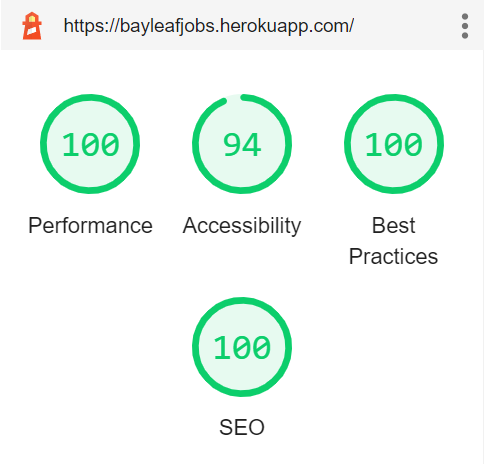

        **Mobile**
        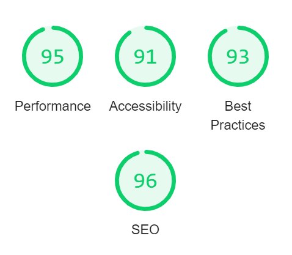

-   ### Am I Responsive?

    -   During the testing phase, I ran further tests on my site's responsiveness using the Am I Responsive website. This has helped me identify some size-related inconsistencies that were not so visible with Google Development Tools.

-   ### Techsini Multi Device Mockup Generator

    -   During my testing phase, I also ran further tests on my site's responsiveness using the Multi Device Website Mockup Generator on Techsini. I then compared my findings with the mockups from Am I Responsive. You can view the mockup below.
    

## HTML Validation

The [W3C Markup Validator](https://validator.w3.org/#validate_by_upload) was used to validate my HTML code to ensure there were no syntax or semantic errors. It passed the validation without any errors.

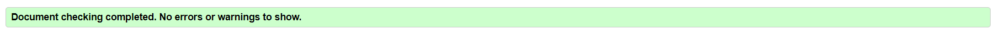

## CSS Validation

The [W3C CSS Validator](https://jigsaw.w3.org/css-validator/#validate_by_upload) was used to validate my CSS code to ensure there were no syntax or semantic errors. It passed the validation without any errors.

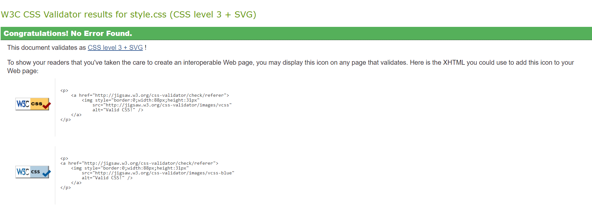

## Javascript Validation

[JS Hint](https://jshint.com/) was used to validate all my Javascript scripts. All scripts passed the tests without any errors. The main warnings were about unused variables in some scripts, which were the class declarations and the exported instances of the classes.

## Accessibility

The [WAVE Web Accessibility Evaluation Tool](https://wave.webaim.org/) was used to test the accessibility of my website. It identified missing ARIA-related attributes (especially in my navigation menu icon) that helped me improve the accessibility of the site for Users with disabilities. The final results, which you can view below indicate no errors.

## Form Validation

-   I made sure to validate my forms and ran suitable tests using different input scenarios. I can confirm that all of them behaved as expected. 

-   I have tested that my required input attributes behaved as expected and warned users to fill the required fields.

-   I have tested that the submitted form is being sent to the database containing all the information added by the user.

## Further Testing

-   The website was viewed and tested on a variety of devices such as Desktop, Laptop, iPad, and a variety of Android and iOs mobile phones. 

-   The website was viewed and tested on a variety of browsers.
    -   Chrome
    -   Firefox
    -   Safari
    -   Opera
    -   Edge

-   A large amount of testing was done to ensure that all links were working as expected.

-   All buttons were carefully tested to ensure they were linking to the correct page.

-   Friends, family members and other Code Institute students were asked to review the site and documentation to point out any bugs, typos and/or user experience issues.

## Testing Methodology

Code changes were carefully tested prior to committing and pushing to GitHub. This was in an attempt to prevent faulty or broken code from being pushed to the repository or deployed to the live site. 

# Deployment

## Github Repository

The project was stored on Github using the following steps.

1.  I logged into my account on GitHub - [My account](https://github.com/MikeAvgeros)

2.  I created a public repository for my 3rd Milestone project - [bayleafjobs](https://github.com/MikeAvgeros/bayleafjobs)

## Heroku

The project was deployed using Heroku, directly from the master branch via GitHub.

The following steps were taken to complete the deployment process.

1.  I created an account on Heroku

2.  Created a requirements.txt file, using pip3 freeze --local > requirements.txt, to allow Heroku to detect this project as a python app and install any required dependencies.

3.  Created a Procfile using echo web: python app.py > Procfile so Heroku would be informed on which file runs the app and how to run this project.

4.  Created a new Heroku app, bayleafjobs and set its region to Europe and programming language to Python.

5.  Automatic deployment was set up on Heroku - On the dashboard, in the deploy menu. Connect to GitHub section. The GitHub repository was searched for and connected to the app.

6.  On the settings tab on the dashboard, 'Reveal Config Vars' was used to tell Heroku which environment variables are required to run the app. The following config vars were added:

    -   IP
    -   PORT
    -   SECRET_KEY
    -   MONGO_URI
    -   MONGO_DBNAME
    -   MAIL_USERNAME
    -   MAIL_PASSWORD

7.  Clicked the Enable Automatic Deploys button located in the Deploy section of Heroku to allow for automatic deploys.

8.  Clicked the Deploy Branch button located in the Deploy section of Heroku to finally deploy this project.

9.  Clicked the View button to launch this project's app. You can view the live site [here](https://bayleafjobs.herokuapp.com/).

10. The deployed site on Heroku will get updated automatically with any new commits to the master branch in the GitHub repo.

## Cloning the Github Repository

The Github repository was cloned and stored locally on my machine using the following steps. 

1.  I cloned my [Github Repository](https://github.com/MikeAvgeros/bayleafjobs) using SSH, under "Clone", and copied the link.

2.  I opened [SourceTree](https://www.sourcetreeapp.com/), opened a new tab and clicked on the Clone icon. I pasted the SSH link and added a local directory on my machine.

3.  I opened [VS Code](https://code.visualstudio.com/), clicked on File/Open File and navigated to the local directory I had cloned my Github repository.

4. I installed all the required dependencies using CLI on the local directory on my machine.

# Credits

## Images

I have used the following images from [Pixabay](https://pixabay.com/).

# Acknowledgements

-   I would like to thank my mentor, [Narender Singh](https://linkedin.com/in/nar3nd3r) for his support, guidance and design ideas.

-   I would like to thank the [Code Institute](https://codeinstitute.net/) for the well-thought-out curriculum and their amazing and super informative and helpful Slack community!

-   I would like to thank the Coding Novas group and everyone at the Full Stack Developers WhatsApp group for their helpful input during my testing phase.

